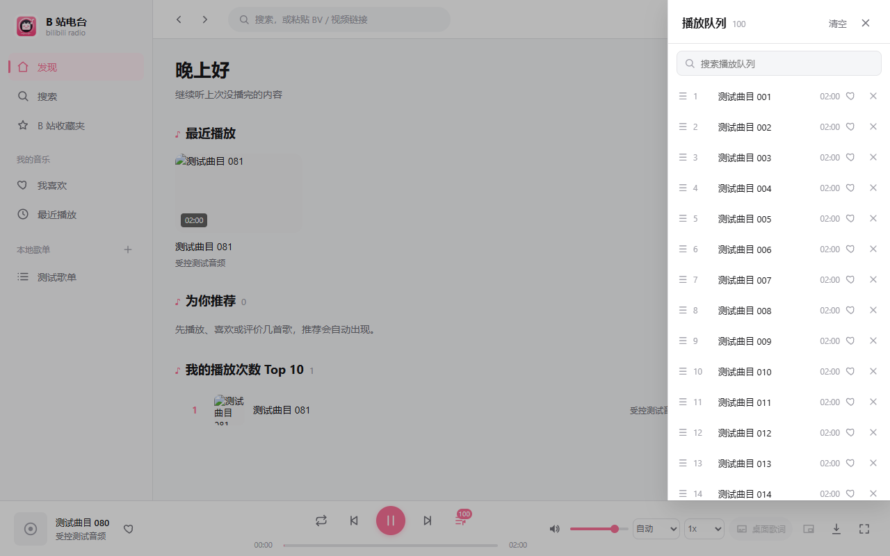

# 桌面播放体验：需求拆解、实测与源码定位

日期：2026-09-29。

历史诊断记录：下述问题以 `cc76d59` 源码与 0.1.4 测试程序为基线，文中旧行号仅对应该快照。本轮后续实现已完成，当前行为和验证结果请看 [0.2.0 实现报告](desktop-playback-tray-implementation-2026-09-29.md)。

本轮只推送既有 CI/CD、整理文档、复现问题和拆解下一轮任务，**不修改播放器、后端业务或桌面功能代码**。

## 基线和交付状态

- 源码基线：远程 main 的 `54842b2`；本轮 CI/CD 提交为 `cc76d59d209464047ec0eb3baa59de3032e96345`。
- 分支：`develop/restore-main-0828`，已推送至 `bilibili-radio` 远程；未合并 main。
- 本次原生测试使用当前源码构建的 **0.1.4** 桌面程序，没有覆盖安装用户此前的 0.1.6 客户端。
- [GitHub Actions 首次云端运行](https://github.com/ourhome-macro/Bilibili-radio/actions/runs/36557941317)已成功：Windows、Ubuntu 测试与前端构建，以及 Windows 安装包构建、打包后端启动检查全部通过。
- 生成 `windows-x64-installer` artifact，大小 20,900,810 字节；[构建产物入口](https://github.com/ourhome-macro/Bilibili-radio/actions/runs/36557941317/artifacts/11028767650)。不是版本标签推送，因此 Release 发布按规则跳过。
- 已重写项目 README，移除过时的 Socket.IO 运行链路和失效入口描述，新增 [文档索引](README.md)。历史实施记录保留原路径。

## 已确认的用户需求

| 编号 | 确认后的行为 |
| --- | --- |
| R1 | 播放/暂停、上一曲、下一曲快捷键在主窗口、后台和托盘状态都生效 |
| R2 | 最小化和关闭主窗口均进入托盘；通过托盘菜单明确退出 |
| R3 | 再次打开同一集/同一分 P 时能恢复未完成的播放位置 |
| R4 | 能定位到播放队列或歌单中正在播放的音频，不必手动翻找 |
| R5 | 主窗口和悬浮歌词窗口均记住各自的位置 |
| R6 | 点击上一曲立即切到上一曲，取消“第一次回本曲开头、第二次才切歌” |

以下为建议的验收细则，不把建议冒充已确认的独立新功能：启动恢复上次曲目和进度但不突然自动播放；已真正播完的内容下次从头；快捷键首版采用明确的组合键，媒体键和快捷键自定义可后续扩展。

## 复现方式

1. **前端受控浏览器实测**：使用当前未修改的 Vue/Pinia 源码，在隔离的 Edge 浏览器上下文中运行；HTTP 数据和 120 秒静音音频使用固定测试夹具，不依赖真实 B 站网络或用户凭据。通过真实按钮点击、DOM 几何测量、页面重载验证行为；进度测试对真实 HTMLAudioElement 派发受控 timeupdate 事件，不宣称进行了 60 秒真实外网音频收听。
2. **后端实测**：真实 Flask test client 与真实 SQLite，数据放在临时目录，不调用外部 API。
3. **Windows 原生实测**：运行现有 0.1.4 exe，使用独立 WebView2 用户目录、后端临时数据库和日志。Win32 控制窗口，Windows UI Automation 点击歌词按钮。隔离启动器仅用于测试并存放在系统临时目录，不进入业务仓库；测试进程树已结束。
4. **源码检查**：补充全局快捷键、状态保存和关闭生命周期的实现位置及缺失项。没有把纯源码判断标成已经完成的 OS 级快捷键测试。

原始证据：[前端结果](evidence-desktop-audit-2026-09-29/frontend-results.json)、[后端结果](evidence-desktop-audit-2026-09-29/backend-results.json)、[原生窗口结果](evidence-desktop-audit-2026-09-29/native-results.json)。

## 实测结果

| 场景 | 实际结果 | 结论 |
| --- | --- | --- |
| 已有 45 秒历史进度，再点击播放 | 播放位置为 0；没有请求续播接口 | 读取与恢复进度链路没有接入 |
| 从 0 模拟播放到 60 秒，再暂停 | 只发出一次最近播放写入，保存位置为 11 秒 | 达到计数阈值后的进度停止更新 |
| 重载页面，再点同一曲播放 | 队列和曲目恢复，位置仍为 0；播放事件接口请求数为 0 | 队列持久化不能替代逐曲进度持久化 |
| 播放第 81 项，到 40 秒点击上一曲 | 第一次仍是第 81 项，位置变 0；第二次才切到第 80 项 | 与用户要求冲突，原因明确 |
| 100 项队列，当前第 80 项，打开队列 | scrollTop=0；当前行 top=3593，视口仅为 63..720 | 已高亮但不在可视区域，没有自动定位 |
| 搜索其他曲目 | 当前行不在筛选结果中，定位按钮数量为 0 | 缺少显式定位和解除筛选入口 |
| 最近播放接口写入 60 秒 | 最近列表返回 60000ms，续播接口返回 0 | 两个接口使用不同存储表 |
| 10 分钟内容播放 5 秒后暂停 | playback_sessions 已保存 5000ms，续播接口仍为 0 | 续播错误地依赖进入最近播放的阈值 |
| 同一会话发送两个达标心跳 | 最近播放次数变成 2 | 接通心跳前必须处理重复计数，不能直接加定时调用 |
| 原生主窗口最小化 | IsIconic=true，窗口可见样式仍为 true | 仍是普通最小化，没有托盘生命周期 |
| 原生主窗口关闭 | 主窗口被销毁；观察时应用进程仍存活 | 隐藏歌词窗口等资源仍在，缺少可恢复入口与明确退出路径 |
| 主窗口移动并调整大小后重开 | 手动位置 (120,150)，大小 1100×720；重开变为 (156,156)，1296×859 | 没有恢复主窗口几何信息；此处记录的是 Win32 外框尺寸 |
| 歌词窗口移动后隐藏再显示 | 从 (160,180) 回到 (500,824) | 重新显示时被默认定位逻辑覆盖 |

队列现场截图：

## 源码根因

### 1. 续播并非只缺一个保存字段

- [playerStore.ts:374](../bilibili-player/src/stores/playerStore.ts#L374)：requestPlayTrack 无条件把 currentTime 设为 0，随后加载音频，没有恢复逐曲进度。
- [playerStore.ts:324](../bilibili-player/src/stores/playerStore.ts#L324)：canplay 后直接播放，缺少“解析真实分 P → 读取进度 → 等媒体可定位 → seek → 播放”的流程。
- [playerStore.ts:175](../bilibili-player/src/stores/playerStore.ts#L175)：队列快照只有 queue/currentIndex/playMode/updatedAt，没有实时播放位置。
- [playerStore.ts:939](../bilibili-player/src/stores/playerStore.ts#L939)：maybeRecordRecentProgress 达标后设置 playbackRecentRecorded，后续直接返回，因此最近播放只写一次。
- [playerStore.ts:992](../bilibili-player/src/stores/playerStore.ts#L992)：达标后连有效收听时长累积也停止；“是否计入最近播放”和“实时进度”混在一起。
- [libraryStore.ts:166](../bilibili-player/src/stores/libraryStore.ts#L166)及 [client.ts:312](../bilibili-player/src/api/client.ts#L312)：实际走的是 /api/library/recent。
- [library_service.py:155](../py-radio/library_service.py#L155)：写 recent 表；[playback_service.py:171](../py-radio/playback_service.py#L171)的 get_resume 则读 playback_recent。前端也没有调用 /api/playback/events 或 /api/playback/resume。
- [playback_service.py:103](../py-radio/playback_service.py#L103)：只有达到最近播放阈值后才写 playback_recent；短时暂停的进度虽然存在 playback_sessions，也无法通过 get_resume 取到。
- [playback_service.py:129](../py-radio/playback_service.py#L129)每个达标事件都会调用 add_recent；[library_service.py:174](../py-radio/library_service.py#L174)每次都加一次计数。直接补心跳会把收听次数放大。

因此需要分清三个概念：**最新播放位置、有效收听统计、最近播放列表/次数**，分别确定保存和计数规则。SQLite 数据本身并不是完全没有保存。

### 2. 上一曲点两次是显式业务分支

[playerStore.ts:602](../bilibili-player/src/stores/playerStore.ts#L602) 的 prev 在 currentTime > 3 时 seek(0) 并返回。这是当前逻辑造成的行为，不是按钮没收到第一次点击。需要让按钮、快捷键和托盘调用同一个“切到上一曲”命令。

### 3. 队列有当前项样式，但没有定位机制

[QueueDrawer.vue:27](../bilibili-player/src/components/layout/QueueDrawer.vue#L27)的滚动容器、[第 38 行](../bilibili-player/src/components/layout/QueueDrawer.vue#L38)的当前项标记和 [第 113 行](../bilibili-player/src/components/layout/QueueDrawer.vue#L113)的筛选各自存在，但没有打开后滚动、当前项跟随或定位按钮。

[PlaylistDetailView.vue:146](../bilibili-player/src/views/PlaylistDetailView.vue#L146)同样只有 isCurrent 判断，没有把当前曲目带进视口的逻辑。列表索引会随搜索与排序变化，定位应使用稳定的 bvid+cid/trackId。

### 4. 托盘与全局快捷键尚未实现

[Cargo.toml](../bilibili-player/src-tauri/Cargo.toml)没有 tray-icon 特性、global-shortcut 或 window-state 插件；[main.rs:269](../bilibili-player/src-tauri/src/main.rs#L269)的 Builder 没有托盘菜单、主窗口关闭拦截、最小化转隐藏或快捷键注册。

前端只有搜索、Escape 等局部按键处理，没有播放器全局快捷键。仅在 Vue 增加 keydown 不能满足应用失焦、进入托盘后的操作要求。

关闭主窗口后仍有隐藏歌词 WebView，使得“主窗口关闭”和“程序退出”并不等价。现有 [BackendState::drop](../bilibili-player/src-tauri/src/main.rs#L118)的清理也只有在运行时实际释放时才发生，需要设计明确的托盘退出流程。

### 5. 两种窗口的位置问题不同

- 主窗口：[tauri.conf.json:15](../bilibili-player/src-tauri/tauri.conf.json#L15)只配置默认大小，没有几何状态保存与恢复；原生层也未持久化 moved/resized 状态。
- 歌词窗口：[main.rs:318](../bilibili-player/src-tauri/src/main.rs#L318)初始化定位；[main.rs:381](../bilibili-player/src-tauri/src/main.rs#L381)按主显示器工作区域计算底部居中；[main.rs:496](../bilibili-player/src-tauri/src/main.rs#L496)重新显示隐藏窗口时再次执行定位。隐藏状态下调整字体大小，也会走默认定位路径。

歌词窗口需要停止反复覆盖用户位置；主窗口则需要补完整的持久化恢复。

## 下一轮实施拆解

| 批次 | 优先级 | 工作内容 | 主要文件/模块 | 完成标准 |
| --- | --- | --- | --- | --- |
| T1 | P0 | 将本次复现转换为正式前后端回归测试，增加播放器状态与组件测试入口 | 后端 tests；前端测试配置及用例 | 修复前能稳定复现问题，修复后断言通过，不依赖 B 站网络 |
| T2 | P0 | 独立保存逐用户、逐分 P 最新进度，统一续播读写，并将播放计数与心跳解耦 | database.py、playback_service.py、library_service.py、app.py | 短时暂停也能续播；倒退保存最新位置；同一会话多次心跳不重复计数 |
| T3 | P0 | 前端恢复与保存闭环，建立统一播放器控制语义，修改上一曲 | playerStore.ts、StreamingAudioPlayer.ts、api/client.ts、types | seek 完成后再播放；旧异步请求不串曲；上一曲一次切换 |
| T4 | P0 | 桌面单实例、托盘、后台快捷键和退出清理作为一个生命周期单元实现 | src-tauri/main.rs、Cargo 清单/锁、capabilities、desktop/runtime.ts、主窗口控制桥接 | 最小化/关闭进托盘；快捷键可后台操作；显式退出清理主窗、歌词、后端与快捷键 |
| T5 | P1 | 主窗口和歌词窗口分别保存位置/大小及正确恢复，处理显示器和 DPI 变化 | 原生窗口状态管理、歌词定位函数、Tauri 配置 | 隐藏再显示和重启均恢复，断开副屏也不会落在屏幕外 |
| T6 | P1 | 队列与歌单定位当前音频 | QueueDrawer.vue、PlaylistDetailView.vue、TrackRow.vue、uiStore | 打开长队列可看到当前项，筛选后可一键定位，手动浏览不会被播放进度持续拉回 |
| T7 | P0 | 真实 Windows 验收、完整打包、回归与发布准备 | CI、桌面 smoke/e2e、版本与说明 | 既有测试和新增回归全绿，重复开关/托盘/异常退出无残留进程，不发布未经验证的标签 |

依赖关系：T1 → T2 → T3；T4 依赖 T3 的统一控制与退出前保存；T5 与 T4 共用窗口生命周期；T6 依赖稳定曲目标识；最后执行 T7。T4/T5 都涉及 main.rs，不宜在没有统一设计时各自插入事件处理。

## 关键实现约束

### 进度与恢复

- 进度按用户和解析后的 bvid+cid/trackId 保存，不能只按 BV 号，不能把同一视频的不同分 P 混在一起。
- 建议独立进度表/独立数据职责；计入最近播放仍可保留有效收听阈值，但该阈值不得阻止进度保存。
- 播放中定期保存（建议 5 秒一次），暂停、seek 完成、切曲、退出时补一次；正常退出前由桌面与前端握手完成保存。不能只依赖 beforeunload 请求。
- 网络失败时保留用户隔离的本地恢复信息，重试有明确顺序校验，避免旧会话延迟请求覆盖新位置。
- actual position 和 listen duration 分开处理，回退到 50 秒后应恢复到 50 秒，不应取历史最大位置；心跳不增加播放次数。
- 音频元数据可用后再 seek；沿用并补强 playSeq 防止快速切曲时旧流、旧字幕或旧进度回写新曲目。
- 真正播放完毕可以从头；仅达到历史统计中的“完成比例”不应无条件丢弃尚未听完的结尾。
- 崩溃或强杀无法保证最后瞬间落库，验收以最多丢失一个保存周期为目标。

### 托盘与快捷键

- 默认建议组合键：Ctrl+Alt+Space 播放/暂停，Ctrl+Alt+Left 上一曲，Ctrl+Alt+Right 下一曲。具体键位可以在实施时调整，但后台可用是已确认要求。
- 使用原生全局快捷键，只响应一次按下事件，处理长按、重复注册和组合键被占用的情况。
- 主窗口是唯一播放器控制接收者；歌词窗、托盘和快捷键发送命令，不创建第二套音频实例。
- 最小化和关闭转为隐藏，托盘可恢复主窗口；保留显式“退出”，并确保进度保存、后端结束及快捷键注销有序进行。
- 主窗口、歌词窗口、真正退出采用不同状态，避免关闭主窗留下不可找回的后台进程。
- 单实例行为需覆盖重复双击程序，恢复已有窗口并保持唯一后端，避免托盘重复与全局热键冲突。

### 窗口位置和列表定位

- main 和 desktop-lyrics 分别持久化；不把 minimized/hidden 状态机械恢复成启动后没有窗口。
- 只保存有效的正常窗口边界，避免最小化时保存无意义坐标；在当前显示器工作区域内校正位置。
- 原保存位置有效时，歌词窗口重新显示不再执行底部居中；首次启动或原显示器不可用时才采用默认位置。
- 列表打开后等 DOM 就绪再定位，筛选和排序用稳定曲目标识映射；增加显式“定位当前播放”。
- 用户正在搜索或手动滚动时，不因每个 timeupdate 强制拉回；定位操作遇到筛选隐藏当前项时，应明确解除筛选并定位或提示，而不是静默无效。

## 验收矩阵

| 验收项 | 必测场景 |
| --- | --- |
| 续播 | 同一集重开；同 BV 不同分 P；未达 10% 就暂停；后退 seek；播完重播；快速切曲；网络失败重试；正常退出/强杀再开 |
| 上一曲 | 播放超过 3 秒仍一次切曲；暂停状态；顺序首项；列表循环；随机播放按历史返回；按钮/快捷键/托盘一致 |
| 快捷键 | 前台、失焦、托盘；键位占用；长按；多次打开窗口不重复触发；退出后释放 |
| 托盘 | 最小化和关闭；双击/菜单恢复；显式退出；后台继续播放；重复启动只有一个实例；无孤儿后端 |
| 位置 | 主窗口重启；歌词隐藏再显示；歌词重启；最大化恢复；100%/150% DPI；主副屏切换和拔掉副屏 |
| 列表定位 | 100/1000 项长列表；当前项不在视口；搜索隐藏当前项；拖拽排序；删除当前项；暂停仍可定位；歌单无当前项 |
| 发布回归 | Python 测试、前端测试与构建、Windows 安装包、打包后端启动、版本标签校验保持通过 |

本次已有 95 项后端测试和 6 项版本测试在云端通过，但它们没有覆盖上述全部交互，因此下一轮必须补针对性回归，不能只依赖现有绿色 CI。

## 官方实现参考

- [Tauri 全局快捷键](https://v2.tauri.app/plugin/global-shortcut/)
- [Tauri 托盘](https://v2.tauri.app/learn/system-tray/)
- [Tauri 窗口状态](https://v2.tauri.app/plugin/window-state/)

本轮到此形成可实施的任务清单。下一轮再开始产品代码、数据库迁移和正式回归用例的实现。
